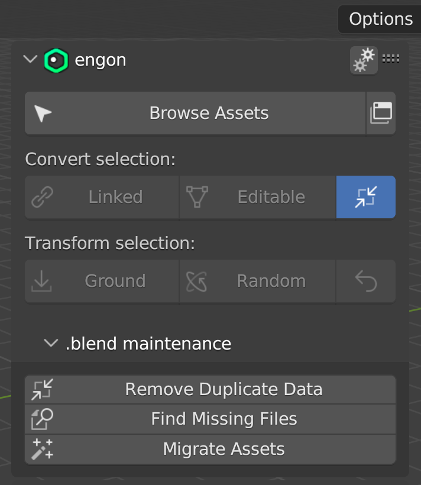
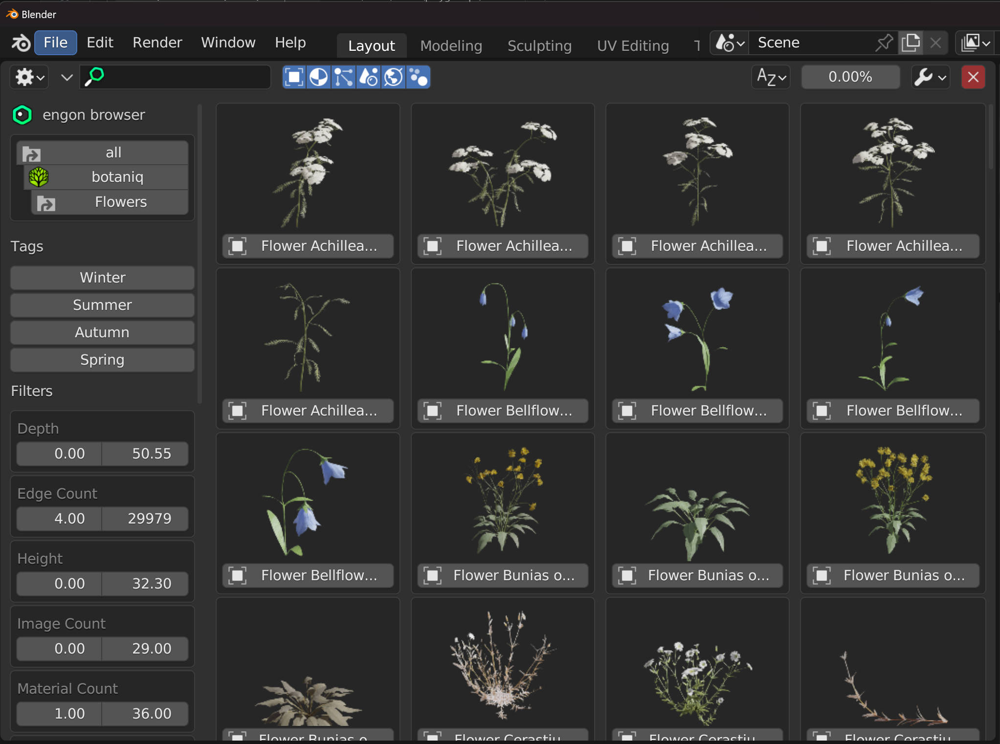

<h1 align="center">
  
</h1>

  engon
   
  <a href="#about"><strong>Check out the screenshots »</strong></a>
   
   
  <a href="https://github.com/polygoniq/engon/issues/new?assignees=&labels=bug&template=01_BUG_REPORT.md&title=bug%3A+">Report a Bug</a>
  ·
  <a href="https://github.com/polygoniq/engon/issues/new?assignees=&labels=enhancement&template=02_FEATURE_REQUEST.md&title=feat%3A+">Request a Feature</a>
  ·
  <a href="https://github.com/polygoniq/engon/issues/new?assignees=&labels=question&template=04_SUPPORT_QUESTION.md&title=support%3A+">Ask a Question</a>

 

Table of Contents

- [About](#about)
- [Getting Started](#getting-started)
  - [Prerequisites](#prerequisites)
  - [Installation](#installation)
    - [Download the addon ZIP](#download-the-addon-zip)
    - [Install ZIP in Blender](#install-zip-in-blender)
  - [Updating](#updating)
- [Roadmap](#roadmap)
- [Support](#support)
- [Project assistance](#project-assistance)
- [Contributing](#contributing)
- [License](#license)

---

## About

> engon is a small code-only addon that contains all asset addon functionality: spawning, variants,
> find missing files, snap to > ground, animations, ... All the former addon functionality: botaniq
> scatter, ... in one big addon containing all the code. That way we can ship bug fixes and add
> even more functionality very quickly. And you can auto-update without downloading tens of GB of
> assets every time.

Screenshots

 

|                             Addon Panel                                      |                            Asset Browser                                     |
| :--------------------------------------------------------------------------: | :--------------------------------------------------------------------------: |
|      |        |

## Getting Started

### Prerequisites

> You need [Blender 3.3 LTS or higher](https://blender.org). Windows, macOS 10 and Linux are
> supported.

### Installation

#### Download the addon ZIP

|                          Stable Release                                                  |                         Unstable Master Branch                   |
| :--------------------------------------------------------------------------------------: | :--------------------------------------------------------------: |
| Head over to [Releases](https://github.com/polygoniq/engon/releases) for a stable ZIP.   | Click `Code` -> `Download ZIP` if you are feeling adventurous.   |

#### Install ZIP in Blender

Go to `Edit` -> `Preferences`. And select `Add-ons` in the left bar. Click the `Install...` button
in the top section. Select the ZIP file you just downloaded and click `Install Add-on`. After the
installation finishes, check the checkbox next to the `engon` addon.

### Updating

The addon can auto-update itself to latest stable or even unstable master version. Head over to
`Edit` -> `Preferences` and select `Add-ons` in the left bar. Type `engon` into the search bar
and then expand the addon section of `engon`. Scroll down to the auto update section to set up
update intervals or even update manually.

## Roadmap

See the [open issues](https://github.com/polygoniq/engon/issues) for a list of proposed features (and known issues).

- [Top Feature Requests](https://github.com/polygoniq/engon/issues?q=label%3Aenhancement+is%3Aopen+sort%3Areactions-%2B1-desc) (Add your votes using the 👍 reaction)
- [Top Bugs](https://github.com/polygoniq/engon/issues?q=is%3Aissue+is%3Aopen+label%3Abug+sort%3Areactions-%2B1-desc) (Add your votes using the 👍 reaction)
- [Newest Bugs](https://github.com/polygoniq/engon/issues?q=is%3Aopen+is%3Aissue+label%3Abug)

## Support

Reach out to the maintainers at one of the following places:

- Joining our [Discord community](https://polygoniq.com/discord/) for the fastest support.
- [GitHub issues](https://github.com/polygoniq/engon/issues/new?assignees=&labels=question&template=04_SUPPORT_QUESTION.md&title=support%3A+)
- Contact options listed on [this GitHub profile](https://github.com/polygoniq)

## Project assistance

If you want to say **thank you** or/and support active development of engon:

- Add a [GitHub Star](https://github.com/polygoniq/engon) to the project.
- Tweet about engon.

Together, we can make engon **better**!

## Contributing

First of, thanks for taking the time to contribute! Contributions are what make the open-source
community such an amazing place to learn, inspire, and create. Any contributions you make will
benefit everybody else and are **greatly appreciated**.

Please read [our contribution guidelines](docs/CONTRIBUTING.md), and thank you for being involved!

## License

This project is licensed under the **GNU General Public License v3**.

See [LICENSE](LICENSE) for more information.